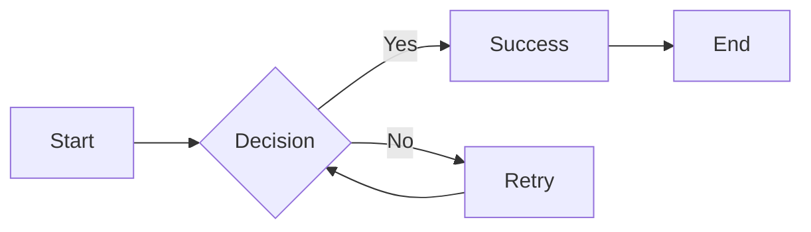

# Smart Markdown Visualizer

A powerful, real-time Markdown editor and visualizer with support for advanced features including syntax highlighting, mathematical notation, and interactive diagrams.


## ✨ Features

- **📝 Live Preview** - Real-time rendering as you type
- **🎨 Syntax Highlighting** - Beautiful code blocks with automatic language detection
- **📊 Mermaid Diagrams** - Create flowcharts, sequence diagrams, ERDs, and more
- **🧮 Mathematical Notation** - LaTeX math rendering powered by KaTeX
- **📋 GitHub Flavored Markdown** - Tables, task lists, strikethrough, and more
- **🔄 Synchronized Scrolling** - Editor and preview stay in sync
- **💾 Export Options** - Download as Markdown, HTML, or PDF
- **🔒 Security-First** - Built-in XSS protection with rehype-sanitize
- **⚡ Fast & Responsive** - Optimized performance for large documents

## 🚀 Quick Start

### Prerequisites

- Node.js 18.0 or higher
- npm 9.0 or higher

### Installation

```bash
# Clone the repository
git clone https://github.com/yourusername/markdown-visualizer.git
cd markdown-visualizer

# Install dependencies
npm install

# Start the development server
npm run dev
```

The application will open at **http://localhost:3000**

## 📖 Usage

### Basic Editing

1. Type or paste Markdown in the left editor pane
2. See the rendered output in real-time on the right
3. Use the controls to toggle word wrap and synchronized scrolling

### Export Your Work

Click the export buttons in the preview header:

- **📄 .MD** - Download as Markdown source
- **🌐 HTML** - Export as standalone HTML file
- **📑 PDF** - Print or save as PDF

### Supported Markdown Features

#### Code Blocks with Syntax Highlighting

```javascript
function greet(name) {
  console.log(`Hello, ${name}!`);
}
```

#### Mathematical Equations

Inline math: $E = mc^2$

Block math:

$$
\int_{-\infty}^{\infty} e^{-x^2} dx = \sqrt{\pi}
$$

#### Mermaid Diagrams



#### Tables

| Feature          | Status |
| ---------------- | ------ |
| Syntax Highlight | ✅     |
| Math Equations   | ✅     |
| Diagrams         | ✅     |
| Export           | ✅     |

## 🏗️ Project Structure

```
markdown-visualizer/
├── packages/
│   ├── core/          # Core Markdown processing library
│   ├── web/           # Next.js web application
│   ├── cli/           # Command-line tool (planned)
│   ├── lsp/           # Language Server Protocol (planned)
│   └── vscode-ext/    # VS Code extension (planned)
├── docs/              # Documentation
├── examples/          # Example Markdown files
└── prompts/           # AI agent prompts
```

## 🛠️ Development

### Available Commands

```bash
# Development
npm run dev              # Build core + start web dev server
npm run build:core       # Build core library
npm run build:all        # Build all packages

# Testing
npm test                 # Run tests (when implemented)

# Linting
npm -w @visualizer/web run lint
```

### Architecture

- **Core Library** (`@visualizer/core`) - TypeScript-based Markdown processing pipeline

  - Unified/Remark/Rehype plugins
  - Security-hardened with rehype-sanitize
  - Supports GFM, math, syntax highlighting, and diagrams

- **Web App** (`@visualizer/web`) - Next.js application
  - CodeMirror editor with Markdown mode
  - Real-time preview rendering
  - Export functionality

## 🔒 Security

This project implements defense-in-depth security measures:

- ✅ XSS protection via `rehype-sanitize`
- ✅ Mermaid diagrams run in strict security mode
- ✅ Content Security Policy headers
- ✅ Path traversal protection in CLI (planned)
- ✅ Input sanitization at every layer

See `packages/core/SECURITY.md` for detailed security architecture.

## 🗺️ Roadmap

### Phase 1: Core & Web ✅ (Complete)

- [x] Monorepo with npm workspaces
- [x] Core Markdown processing engine
- [x] Web application with live preview
- [x] Export functionality (MD, HTML, PDF)

### Phase 2: Advanced Features ✅ (Complete)

- [x] GitHub Flavored Markdown
- [x] Code syntax highlighting
- [x] Mermaid diagrams
- [x] Mathematical notation (KaTeX)
- [x] XSS protection

### Phase 3: CLI Tool 🚧 (Planned)

- [ ] Command-line Markdown converter
- [ ] Watch mode for live rebuilds
- [ ] Theme support
- [ ] Batch processing

### Phase 4: Editor Integration 🚧 (Planned)

- [ ] Language Server Protocol implementation
- [ ] VS Code extension
- [ ] Real-time diagnostics
- [ ] Auto-completion

### Phase 5: Advanced Capabilities 📋 (Future)

- [ ] Custom themes
- [ ] Plugin system
- [ ] Collaborative editing
- [ ] Cloud storage integration
- [ ] Mobile app

## 🤝 Contributing

Contributions are welcome! Please follow these guidelines:

1. Fork the repository
2. Create a feature branch (`git checkout -b feature/amazing-feature`)
3. Commit your changes using Conventional Commits
4. Run tests and linting
5. Push to your branch
6. Open a Pull Request

## 📄 License

This project is licensed under the ISC License.

## 🙏 Acknowledgments

Built with:

- [Unified](https://unifiedjs.com/) - Markdown processing
- [CodeMirror](https://codemirror.net/) - Code editor
- [Mermaid](https://mermaid.js.org/) - Diagram generation
- [KaTeX](https://katex.org/) - Math rendering
- [Next.js](https://nextjs.org/) - React framework
- [DOMPurify](https://github.com/cure53/DOMPurify) - HTML sanitization


**Made with ❤️ for the Markdown community**
